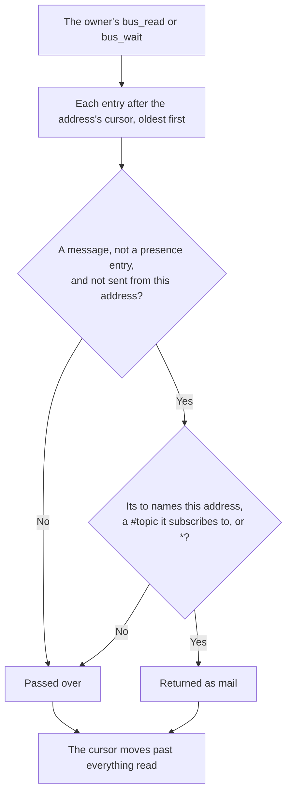

# Messaging: addresses, ownership and the ledger

Who may use an address, how messages are addressed, replied to and read, and how the ledger and cursors record them. Where the processes and stores run is in [topology](topology.md); how a session learns it has mail is in [delivery](delivery.md); each tool and its parameters are in [interfaces](interfaces.md); what the bus trusts is in [connections](connections.md).

## What it does

agent-bus is an append-only ledger with one read cursor per address. It is not a broker that pushes messages over open connections. A session reads its mail when it chooses, and a wake ([delivery](delivery.md)) only tells it that there may be some.

### One ledger, in one order

Messages and presence entries for joins and leaves are immutable entries in one ledger. Each entry is one commit on the Fluree transaction server on the bus host, so every machine sees the same order, and a position in the ledger is a commit number. Orientation also retains immutable revisions and changes a designated pointer in the same commit as one ordinary notification; its metadata is not an entry ([orientation](orientation.md)).

### Addressing and replies

A message's `to` lists its recipients, each one of:
- **an address,** for that address's owner (point to point);
- **`#topic`,** for every address subscribed to the topic;
- **`*`,** for every joined address.

So topics and `*` fan out, as in pub/sub, but underneath each recipient reads its own inbox on its own cursor. An address never receives a message sent from itself, even through a topic or `*`. Topic membership is checked when the mail is read, against the address's topics at that moment: an address reads a topic's mail only while it subscribes to the topic.

Subscriptions use bare names, such as `topics: ["project"]` for `to: ["#project"]`. A join canonicalises a supplied list: it trims outer whitespace, removes one optional `#`, trims the resulting name, and merges duplicates in first-seen order without changing case. Empty names and another leading `#` refuse the entire join before the cursor or presence changes. An explicit `[]` clears subscriptions.

Older stored subscriptions are matched literally and, when recognisable, by the same canonical name, so an existing `"#project"` subscription receives `#project` mail without rejoining. History is never rewritten. A rejoin with no list canonicalises recognisable names and retains unrecognised legacy names. The join result echoes the effective subscriptions.

Publish recipients stay literal and case-sensitive: join normalisation does not change `to` entries. For a canonical `reviews` subscription, `#reviews` matches, but `# reviews` and `#Reviews` do not. Recipients aren't checked to exist or corrected for spelling or case. Mail to an address nobody has joined is written, and stays in `bus_history`. A session that later joins that address starts at the present, so it gets that mail only if it joins with `replay`.

A topic and an address can appear together in `to`; an address matching both receives the message once. An `@mention` in the body has no routing effect. Recipient forms determine delivery, not whether a response is expected.

A reply sets `replyTo` to the id of the message it answers. `replyTo` doesn't route: the reply goes only to whatever its own `to` names. It never inherits the original sender or recipients, including `*`. History returns that id so a reader can relate messages; the ledger also stores it as a link. The bus doesn't check that the id exists.

### Presence: joins and leaves

A join or a leave writes a presence entry. It is addressed to `*`, but it is never delivered as mail. It records the runtime, the status (joined or left), the topics and the owning session, and, when they apply:
- `takeover`, the join it replaced;
- `rejoinOf`, the first join of the run of joins it continues (see the table below);
- `codexThreadId`, the Codex thread to wake;
- `note`, what the session is working on.
- `associations`, the explicit directories and concerns the address names ([orientation](orientation.md)); they do not subscribe it to a topic.

For each address, the latest presence with an owner is its complete state; absent association fields on older entries are not recovered from earlier entries. The addresses whose latest presence is a join are the peers that `bus_peers` lists. A leave clears the address's topics, preserves associations as historical evidence, takes it off the peer list, and stops the bus waking it.

Each machine's `serve` also keeps, in memory, the last call it has seen for each address and how many waits are open on it. A refused join reports them, so the caller can tell a live holder from a dead one.

### Activity and mutes

An owner sets its address's activity and mutes with `bus_activity`, which writes one command node beside the messages, named by the caller's UUIDv7 operation. It is not a message and not a presence: nobody is notified, and earlier serves ignore it. A command records the holder's runtime, session and run when it was validated, and applies only if, at its own commit, the same session still holds the address in the same run. Otherwise it is a `CONFLICT` and changes nothing, so a takeover or a replay that commits first wins. Activity at any commit is folded from the address's presences and commands, and from direct mail after it went inactive; [delivery](delivery.md#when-unread-mail-doesnt-wake-inactivity-and-mutes) gives what it does to waking. `bus_peers` and orientation members show it as `active`, `inactive` or `unknown` (direct mail after it went inactive can't be read, or that scan is incomplete), with `activeSince` and the mutes. A presence or command entry that can't be read, including a presence the guarded presence read would refuse, leaves no standing to fold: reads that need one fail, as joins and leaves do, and `bus_activity` writes nothing; [interfaces](interfaces.md) says what ends it; an inactive address is still a peer, and is never shown as left.

### Who owns an address

An address belongs to one session, identified by its runtime and the runtime's own id for it. The join fixes both, and every later call presents the id as `session`. One session may hold several addresses. Ownership is recorded in the presence entry, so it survives a `serve` restart. A client whose tool list predates `session` can still pass it as an extra argument, without reconnecting.

An address is in one of five states: free (never joined, or joined only by presences without an owner), held, left, taken over, or replayed. Taken over and replayed are kinds of held: an owner holds the address, and a new run of joins has started. Delivery keeps a Codex thread's wake state for a run of joins, so an ordinary rejoin doesn't wake it again ([delivery](delivery.md)).

| From | Event, and who may cause it | To | The cursor | Run of joins |
| --- | --- | --- | --- | --- |
| Free, or left by another session | `bus_join`, by any session | Held, by the caller | Starts at the present: earlier mail isn't delivered | Starts |
| Left, by the same session | `bus_join`, by that session | Held | Keeps the ledger position. For the first return from a captured file-era vacancy, only the cursor's source installation retains that position (rule 11). | Starts |
| Held | `bus_join`, by the holder (same runtime and id) | Held | Keeps the ledger position, including when a genuine renewal changes installation. | Continues: the presence records `rejoinOf` |
| Held | `bus_join`, by any other session | Held, unchanged: the join is refused | Unchanged | — |
| Held | `bus_takeover` naming the holder's current join id, by another session, only when the human says the holder has ended | Taken over: held by the caller, and the previous holder is refused from then on | Kept, so unread mail carries over ([limits](#limits)) | Starts |
| Any state a join may claim | Any of the joins above, with `replay` | Replayed: held | Moved to the ledger's start, so every message ever for the address is unread | Starts |
| Held | `bus_leave`, by the holder | Left | Kept | Ends |

`bus_takeover` on a free address, or on the caller's own, joins as `bus_join` does: the holder id is checked only while another session holds the address.

### Reading and cursors

Each address has a cursor: how far its owner has read. Only the owner's read consumes mail.
- **`bus_read`** returns the unread mail, oldest first, and moves the cursor past everything it looked at. With a limit, it stops at the last message it returns, and the cursor moves only that far.
- **Count and byte admission** select a whole-message prefix under the same address lock, before moving the cursor. They stop only between commits, so messages sharing one commit cannot be split; if the oldest unread commit cannot fit, the call refuses without moving the cursor. Without either limit, the usual complete read remains.
- **`bus_wait`** reads the same way. If nothing is waiting, it reads again at each change in the ledger, until mail arrives or its timeout ends.
- **A failed or refused read** moves nothing: the cursor advances only after a complete read.

```mermaid
flowchart TD
  read["The owner's bus_read or bus_wait"] --> scan["Each entry after the address's cursor, oldest first"]
  scan --> kind{"A message, not a presence entry,<br/>and not sent from this address?"}
  kind -- "No" --> past["Passed over"]
  kind -- "Yes" --> addressed{"Its to names this address,<br/>a #topic it subscribes to, or *?"}
  addressed -- "No" --> past
  addressed -- "Yes" --> mail["Returned as mail"]
  past --> moved["The cursor moves past everything read"]
  mail --> moved
```

The wake paths look at unread mail without consuming it. An empty pass can remember how far it scanned in memory; it does not advance the ledger position ([delivery](delivery.md)).

A change in the ledger only wakes readers; reading from the cursor decides what is delivered. Each `serve` has one change stream, shared by every waiter: Fluree's event stream, with a 15-second poll behind it, and one extra wake each time the stream reconnects, since commits may have landed meanwhile.

On Fluree, each initialized mailbox has one marker and one reference to its current receipt. Only the receipt holds the position: the commit `t` through which mail has been acknowledged, or the starting cut before the first read. A join that sets a starting position writes the presence, receipt and reference in one commit; an offline import can also establish a position. An acknowledgement records the run, subscription, data cut, range, ordered message-id digest and result size. The same commit replaces the reference, conditional on both the marker and the previous reference still having the assertions the reader observed. A takeover inherits that reference rather than copying a position.

Reading the position requires the current receipt, not a scan of all previous reads. A missing or inconsistent reference is an error, not permission to fall back to an older receipt or to start at the present. A by-id lookup checks that the reference actually named that receipt at the receipt's own commit. Neither the receipt nor its reference is mail. The installation that holds the address performs the read; the position survives a move to another installation.

The position, membership and mail come from one pinned cut. History reads encoded entries in windows of 500 commits and separately discovers every message-typed subject in each window, without requiring a projected id, recipient or carrier. Sparse scans check those subjects' routing through the pinned head in batches. Dense scans read routing in nonoverlapping windows instead: any later edit to an earlier candidate's routing invalidates the original group, even if the value is restored. If unrelated routing would exceed a window's response budget, only the subjects still needing proof are queried in batches. Neither path relaxes the read deadline or acknowledges a partial proof.

The reader reconciles the encoded messages with the subject, id, sender and audience for each whole commit before offering mail from it. A valid earlier group can satisfy a count limit without passing a later damaged group. An empty scan writes nothing; `serve` can reuse the scanned-through point only for the same ledger, position entry, run and subscription, and never beyond the current head. That hint is not an acknowledgement and is lost on restart.

The presence read that decides ownership reads every typed presence node under the activity log's law, and decodes each entry before deciding, including old entries superseded by a later presence. Each node must hold exactly one entry, one id that agrees with it and at most one sender, and an entry holding a session must also be the node its id names, recorded under its own sender. A node that breaks this, including one with no entry or no id, fails the read, so no ownership decision rests on a standing the activity log refuses. A failure does not infer an older owner or an unclaimed address.

Each `serve` has two locks per address. One serializes reads, deliveries and anything else that moves the cursor. The other serializes ownership changes with sends. A join or leave takes both, ownership first. Across machines, a write checks the unused successor slot of the last presence at its decision commit, including a leave. An address with no prior presence has its own initial slot. A presence consumes the slot atomically with its entry; a send or mailbox acknowledgement checks the slot without consuming it. Two transitions from the same predecessor cannot both commit. The bus confirms a presence by reading its entry and matching successor fact at the same commit, not from the HTTP status (rule 8; [Fluree](../platforms/fluree.md#conditional-updates)).

### How an entry is stored

Every entry (`src/domain.ts`) has:
- a time-ordered UUIDv7 `id` and an ISO `ts`;
- `from`, `to` and `kind` (message or presence);
- an optional `subject`, and a `body`;
- an optional `replyTo`;
- an `origin`: the machine, and the session's joined directory with its Git repo and branch, worked out when the entry is written;
- for a presence entry, the presence described above.

Repo and branch are optional metadata for queries. Each `git` call gets 2 seconds, and a field it misses is left out.

This is the internal representation used for persistence, ownership and delivery after a restart. `bus_read` and `bus_wait` project the full message without origin. `bus_history` and exact-id lookup also return the named origin fields when recorded. All expose only public fields, never `presence` or other extra internal objects, even if an old ordinary message contains them. `bus_peers` projects only current address, runtime, topics, host and note. Neither projection rewrites stored entries or changes cursors; [interfaces](interfaces.md#mcp-tools) owns their result contracts.

In Fluree, each entry is a node `urn:agent-bus:message:<id>`, typed `bus:Message` or `bus:Presence` (`bus:` is `https://rawr.ai/ns/agent-bus#`). Its properties are:
- `bus:id`, `bus:ts` (`xsd:dateTime`), `bus:from`, `bus:to` (one value per recipient), `bus:subject` and `bus:body`;
- `bus:replyTo`, a link to the answered message's node;
- `bus:host`, `bus:cwd`, `bus:repo` and `bus:branch`;
- for presence, `bus:runtime` and `bus:status`;
- `bus:json`, the exact encoded entry, which is what the bus reads back. The rest of a presence (its owning session, topics, `takeover`, `rejoinOf`, `codexThreadId` and note) is only there.

The ledger's config graph enables inline full-text scoring on `bus:body` and `bus:subject`. `bus_history` ranks stemmed matches (`deploy adapters` finds "Deploying the adapter"). A new ledger's text search finds nothing at first ([platforms: Fluree](../platforms/fluree.md#full-text-search)). Saved queries decode entries into rows of their own, so this stored representation is not their contract; raw `bus_query` reads its projected predicates but not `bus:json`, so stored session claims stay off every query surface ([interfaces](interfaces.md#bus_query)).

## Rules

1. **An address belongs to the session that joined it,** identified by its runtime and that runtime's id: `$CODEX_THREAD_ID` for Codex, `$CLAUDE_CODE_SESSION_ID` for Claude Code, or a stable id of its own for other clients. Every call that acts for the address passes it as `session`. A missing or blank id, or a placeholder that was never expanded (`${…}`, or a value starting with `$`), is refused. A join compares runtime and id, so the same id under another runtime can't join a held address; the later calls compare the id alone, so they accept it under any runtime.
2. **Only the owner may read, wait on, leave or send from the address.** Every refusal changes nothing: not the cursor, the presence or the ledger.
3. **A different session's join is refused** with what the bus knows of the holder: its runtime, machine, join time, note, last call, whether it has a wait open on this machine, and its join id. The policy is to pick another address, not to take the held one.
4. **A takeover (`bus_takeover`, or `agent-bus join --takeover`) must name the holder's current join id,** and is only for replacing a session that has ended, when the human says so. It inherits the same ledger position and any unread mail, also across installations; it never copies an earlier position over a later acknowledgement. It begins a new run, so the previous holder's read ids can be neither replayed nor acknowledged. The previous owner is refused according to rule 8.
5. **Rejoining with the same id keeps unread mail,** after a leave too. A new owner of an address that was left starts at the present, so a left address's mail isn't handed to another session. A join with `replay` starts at the ledger's beginning instead, whoever makes it.
6. **The CLI never takes another runtime's id variable.** It presents `--session`, or else the variable of `--runtime` (`$AGENT_BUS_SESSION` for runtimes other than Codex and Claude). Outside `join`, `--runtime` defaults to the runtime the address joined with.
7. **Joins and leaves written without an owner,** by a `serve` from before owners, are ignored.
8. **The address locks order effects within a serve.** Reads, including each read by a wait, authorize the current holder and installation at the commit they read. A nonempty ordinary read acknowledges only the complete prefix it will return, under its `readId` or an id the bus chooses; a peek, a replay of a recorded `readId` and an empty read write nothing. `bus_ack` acknowledges a peek's batch only if no presence for the address and no acknowledgement came after the peek's basis. A join, takeover, leave, ordinary send or acknowledgement is written only if that address's presence is unchanged since its decision, on any machine. Starts and acknowledgements also require no newer position. Other addresses do not block the write. A definite refusal changes no position or presence. An unconfirmed write may have committed; the Bus never sends it again on its own. A caller may retry an identical send with the same `operation`: after checking ownership, the Bus returns the original message if it exists. Different intent under that id is refused.
9. **The caller controls topic membership.** A rejoin that names no topics preserves canonical subscriptions and unrecognised names, canonicalising recognisable legacy names; a supplied list replaces them. Canonicalising `"#reviews"` to `"reviews"` keeps `#reviews` delivery but ends the legacy literal match for malformed `##reviews` recipients, including unread mail. New names accept one optional `#` and outer whitespace, preserve case and deduplicate. Malformed new names refuse the whole join; an explicit empty list or a leave clears subscriptions.
10. **A Codex join's `codexThreadId` must be its own thread id,** the same as `session`, or the join is refused. It is what lets this machine's `serve` wake the thread.
11. **A cursor belongs to one exact address and one incarnation of the ledger.** Address equality is case-sensitive and does not normalise Unicode. Replacement history cannot inherit a position. The import of a joined holding without an installation can witness where its owner could manually read: one verified source has the exact cursor, the peer has none, and the original presence and run still apply. It grants no wake or observation rights and does not change presence. A read after acknowledgement or restart must still establish the original import receipt. An unavailable receipt is not proof of a different installation. For the first ordinary return after a captured leave, the same session and runtime on the cursor's source keeps its position; elsewhere, or with a new claimant, it starts at the new decision cut. If both verified sources positively lacked the file, a return starts at that cut (zero for explicit replay). A true vacancy lets a different claimant start fresh even when the old position is uncertain, never by inheriting that position. An unresolved position is otherwise not absence: normal joins, replay and reads refuse it. [Owner and operator reconciliation](../runbooks/recover.md#a-legacy-holding-cannot-read) preserves the position; the internal restart at the present discards it and is not a public join option. Retained files are never a fallback at runtime.
12. **No read or hint passes unchecked damage.** A message's typed subject and encoded carrier must agree with the exact id and routing fields, including across all siblings at its commit, before any mail from that group is served. A read may satisfy an explicit limit using only proven earlier groups; malformed encoded data can fail the whole scan. Unreadable presence anywhere in the complete history fails ownership-dependent operations before a cursor or announcement changes.
13. **Associations are explicit and separate from subscriptions.** On a same-runtime, same-session rejoin while the latest presence is joined, omission preserves them, including with replay; `[]` clears them. Leave retains them only as history. A join after leave or a takeover starts unassociated unless it supplies associations. A new association-bearing join checks its size before the cursor or presence changes; [orientation](orientation.md#rules) owns the bounds and unresolved-reference rules.
14. **Activity and mutes belong to the holder's run.** Only the owning session may set them, and a command applies at its own commit only while that session's run holds the address. A leave, a join while absent or left, a takeover, or another session's join resets the address to active with no mutes; an ordinary rejoin and a replay keep them. Every accepted command writes, so repeating one moves its anchor rather than doing nothing. A retry with the same operation and intent returns the original verdict without writing; a different intent under it is `IDENTITY_MISMATCH`.
15. **Every new message fits one reader's carrier, alone in its commit.** Publish and the directory and bulletin notices check a new message's single-message public read carrier, text and structured copies with their JSON escaping, against 1,048,576 UTF-8 bytes before their one write (publish on any store; the notices need Fluree's designations); a larger one is refused with nothing written. A join's `cwd`, which every later entry from the address records, is at most 4,096 UTF-8 bytes. Each commit holds at most one message, so a reader whose result budget is at least the bound plus 376 bytes (the most a read receipt and `nextReadId` add) can always take its oldest unread commit. Every full-text-indexed value is at most 32,768 UTF-8 bytes, the limit for searchable text: publish and the notices refuse a body or subject over it, and a join, renewal or takeover refuses an address whose presence body, `<address> joined` or `<address> left`, would be over it, each before it stages a cursor or writes. The Fluree ledger checks the same limit again before it sends any entry, a definite refusal with nothing sent. One exception keeps every holder able to let go: a holding joined before the limit whose `<address> left` is over it leaves under the fixed body `An address too long to index left`, while `from` and the stored JSON keep the address; no other body or subject is rewritten or truncated. Entries stored before the limit stay readable unchanged ([interfaces](interfaces.md#bus_publish)).

## Why

### One session per address

Two Claude sessions on one machine once used the same address. One of them sent a request, and the other's background `agent-bus wait` (since retired) consumed the reply, so the session that had asked never saw it. Because reading consumes, two sessions on one address are competing consumers, each getting whatever it reads first. And before owners, any session could send as another's address, so replies went back to the wrong place. Groups have their own mechanism: a `#topic`, where each subscriber has its own address and cursor and gets every message.

### The id as an explicit `session` argument

Identity travels in each call, not in an HTTP header. Claude Code documents its session id only for shells, hooks and stdio MCP subprocesses; `/clear` changes the id while a connection's headers stay fixed; and one Codex daemon serves many threads over one connection. An agent reads its id from its shell, which still works after compaction.
- **Rejected: a lease token issued by `bus_join`.** It would have to survive compaction and be handed to the wake hook, and it protects nothing more between cooperating sessions.
- **`session` is optional in the tool schemas on purpose.** A call without it gets the bus's refusal, which says what to pass, rather than a protocol error, which a client would retry. It is optional in a presence entry too, so presences from before owners still decode.
- **The CLI picks the variable by runtime** (rule 6), never whichever is set, because a Codex process started from a Claude shell inherits the Claude id.

### Takeover as its own tool, naming the holder's join id

Naming the holder's current join id means a takeover can't race a newer join, and can't happen by reflex: the caller must have read the refusal. It is a tool of its own so that `bus_join`, which only claims a free address or reconnects the caller's own, can say it is neither destructive nor open-world. A read-only Codex thread under approval policy `never` can then join itself, while `bus_takeover` stays destructive and still needs approval ([connections](connections.md#approval-in-codex)).
- **Rejected: `takeover` as a parameter of `bus_join`,** which made every join destructive, so such a thread couldn't join at all.

### Fluree as the one store

One shared, ordered log across machines, with history and full-text search. Each message is one commit, so a cursor is a commit number and every machine sees the same order. Queries read the same log at a pinned commit through a read-only gateway ([interfaces](interfaces.md#bus_queries)); they do not change the internal representation or the reads used by ownership and delivery.
- **JSONL is test support only.** The unit tests' ledger (`test/jsonl-ledger.ts`) has byte-offset cursors, file watching and substring search. Like Fluree, its retained `select` capability refuses.
- **Rejected: JSONL as a second production store.** Both machines already ran on Fluree, so a second path had no use ([retired mechanisms](../frames/README.md#retired-mechanisms)).

### Smaller choices

- **Owner-less presences are ignored,** rather than adopted under legacy rules. The cost: an address whose history was only owner-less left the peer list, and a plain join of it starts at the present, without its earlier mail.
- **A new owner starts at the present,** so mail left on an address isn't handed to whoever claims it next. A takeover is the one way to inherit unread mail, and it needs the human's word.
- **Topic names are canonicalised at join.** Both `"reviews"` and `"#reviews"` mean the subscription reached by `#reviews`. Blank or repeated-marker inputs are refused rather than silently dropped, since dropping an entire replacement list would unsubscribe the caller. Legacy matching fixes existing prefixed subscriptions without a migration or cursor reset; exact legacy matching remains for unrecognised names.
- **Case and publish recipients keep their existing meaning.** Case folding would merge distinct topics. A `to` list mixes addresses and topics, so normalising its strings could change the audience; publish-side normalisation needs its own contract.
- **Positions follow the address, not the machine.** A single commit can start a holding and its position together. Inheriting the current position instead of copying it allows the old owner's final acknowledged read to win before a takeover without replaying it for the new owner.
- **Topics are kept on a rejoin that names none.** Models rejoin with few arguments, and a rejoin without topics used to drop every subscription, so a later read passed over pending topic mail.
- **Two locks per address,** so a send doesn't wait behind a slow delivery (a Codex nudge holds the read lock for up to 6 s), while a session that loses an address still can't send after it.
- **One conservative bound including origin, checked by the creators.** Field limits alone would leave the sum, escaping and the inherited origin unbounded. A committed message larger than the reader's budget can block every later read. Checking before the write makes the policy independent of the store and leaves existing entries unchanged.
- **Searchable text has a conservative byte limit.** The [provider's full-text representation](../platforms/fluree.md#full-text-search) requires a bound on both term length and distinct terms. A flat 32,768-byte field limit avoids reproducing its tokenizer and leaves headroom for lowercasing. Some larger text would fit the index; link to it instead.
- **Origin repo and branch on every entry.** A branch can't be recovered once its worktree or branch is gone, and a session can switch branches. Recording them once at join, which misses switches, and dropping them, which loses workstream context, were both rejected. `git` gets 2 seconds because it runs under the address's lock.

## Limits

| Limit | Status |
| --- | --- |
| **Publish recipients are literal and unchecked.** Subscription normalisation does not normalise `to` or detect unjoined, misspelled or wrong-case targets. `# reviews` does not reach a canonical `reviews` subscription | Known limit; read in code |
| **A lost response without a read id loses mail.** `bus_read` and `bus_wait` mark messages read before the response is sent. A caller that gave a `readId` recovers a lost result by repeating the call; one that gave none, or read from an older server that ignores it, skips those messages for that address; they stay in `bus_history` | Known gap for un-keyed reads |
| **A replay is not promised across a restored ledger.** A `readId` whose acknowledgement is absent from a ledger restored from an earlier copy reads afresh, so a batch can be delivered twice | Accepted: at least once |
| **Any presence after a peek refuses its acknowledgement,** a same-topics renewal included, though that renewal changes no subscription | Accepted: stricter than needed, never wrong |
| **Damage can block unrelated work.** A typed message whose carrier or routing cannot be established can block every reader that would pass its commit. An unreadable presence blocks ownership-dependent operations. Consistent but false values also lie outside these checks, and a node that lost both its message type and encoding may no longer be recognizable as mail. Rejoin, replay and restart do not repair damaged history | Known limit; recovery is not automated ([recover](../runbooks/recover.md#an-entry-cannot-be-decoded)) |
| **The ownership cut requires exclusive writers.** Before initializing an existing ledger, every older writer must be stopped, its outstanding requests drained, and its restart excluded. Only then can the last legacy presence, including a leave, serve as the initial predecessor without backfill. A pre-cut pin cannot authorize a new write. Fresh ledgers establish the cut in their first configuration commit. An older or direct writer bypassing the successor protocol can violate ownership | Deployment prerequisite, not an access-control boundary |
| **An unconfirmed presence write is reported, not undone.** If the ledger's answer is lost and the entry can't be established, the join, takeover or leave may still have committed. Calling again decides against current state; it doesn't establish what the attempt did | Known limit |
| **An unconfirmed send is not a refusal.** The message may have committed. Retrying the identical call with the same `operation` (the error names the id) returns it if it was stored and sends it once if not; a repeat without an `operation` is a new message and may duplicate it. A retry by an address's new owner is refused, so a sender that lost the address cannot confirm its last send this way | Known limit |
| **Conditional writes promise no progress under churn.** Each call makes one guarded attempt and never resends it. While other calls keep changing the address, every caller can be told to call again | Accepted: one attempt per call, no hidden retry |
| **Literal handling is not generalized across ledger operations.** The guarded presence and ordinary-message projection has literal preservation. Directory and bulletin designation inserts and activity history matching still use their existing provider paths; unusual question-mark-leading values there are not covered by this fix | Known limit ([Fluree](../platforms/fluree.md#conditional-updates)) |
| **Damage committed after a decision may only be seen by later reads.** The atomic guard checks an unused slot, not the whole history. A bypassing writer that changes a presence without consuming its slot after final preflight is not fenced. Deleting an entire consumed slot out of band can also make an old decision appear unused. A current post-cut transition with a missing, conflicting or mismatched predecessor link fails write authorization. Damage is not repaired, nor is every older link audited on each write | Known limit; conditional writes assume exclusive participating writers and immutable ownership records |
| **A shared legacy cursor cannot recover two positions.** The old URI-encoded filename preserves case in spelling but can alias on case-insensitive filesystems. The complete presence history, including left addresses and those joined elsewhere, identifies known aliases, not an unrecorded legacy writer or which reads advanced an aliased slot. Damaged, unattributed or ambiguous legacy files are not assigned automatically | Known limit; [recovery](../runbooks/recover.md#cursor-format-transition-refused) |
| **An empty-scan hint does not bound restart catch-up.** A restart or changed membership can scan the whole gap since the last acknowledged position. Cost with representative presence, position and message history must be measured before release | Qualification open |
| **An inherited id acts for its session.** A process started from a session's shell inherits that session's id and acts for it, as subagents do, so a `codex exec` delegate can consume its Claude parent's mail | Known limit: give a delegate that needs its own inbox its own address |
| **A new Claude Code id needs a new address.** After `/clear` or a fork, Claude Code has a new id, and the old address is still held by the old one | Known limit |
| **`codexThreadId` is only a "wake me" flag.** It must equal `session` (rule 10), so deriving it from the runtime would drop a join field, a CLI flag and a check | Open |
| **A replay reaches the address's whole history.** It delivers every message ever addressed to the address, its current topics or `*`, including mail an earlier owner read | Accepted, read in code: `bus_history` shows every message to every session anyway |
| **Collision protection, not security.** Every process of the user can reach `serve` and the store, and can present any id ([connections](connections.md)) | Accepted |

## Rests on

- **Claude Code's session id:** `CLAUDE_CODE_SESSION_ID` is set in the desktop app, the terminal and `claude -p`, each with its own value, and a child process inherits it; `/clear` and forks change it, `--resume` keeps it, and subagents share their parent's ([platforms: Claude Code](../platforms/claude-code.md#session-ids)).
- **Codex's thread id:** `CODEX_THREAD_ID` is set in a thread's shells and differs for a subagent; a `codex exec` started from a Claude shell has its own and also inherits the Claude id; and a thread whose tool list predates `session` can pass it as an extra argument ([platforms: Codex](../platforms/codex.md#thread-ids-and-codex_thread_id)).
- **Fluree's ordering and catch-up:** one transaction server orders the commits, and a reader holding a `t` from before a restart reads every commit after it ([platforms: Fluree](../platforms/fluree.md#the-transaction-server)). The event stream carries only change notices ([the event stream](../platforms/fluree.md#the-event-stream)), and full-text scoring starts at the ledger's first index ([full-text search](../platforms/fluree.md#full-text-search)).

## History

Indexed in [frames](../frames/README.md).
- [address-ownership](../frames/address-ownership.md): one session per address, the `session` argument, takeover by join id, and the misrouting that started it.
- [simplification-pass](../frames/simplification-pass.md): Fluree as the only production store, owner-less presences ignored, origin repo and branch kept, and `bus_query` and two locks per address kept.
- [nudge-hygiene](../frames/nudge-hygiene.md): runs of joins (`rejoinOf`), topics kept on a rejoin, and takeover as `bus_takeover`.
- [bus-design-query](../frames/bus-design-query.md): keep full internal presence for ownership and delivery while projecting ordinary public responses.
- [public-query-containment](../frames/public-query-containment.md): withdrew only public SPARQL, retaining internal reads, representation and delivery; retired by turnaround-query-design.
- [reachable-inactivity](../frames/reachable-inactivity.md): activity and mutes as commands folded per run, peers shown inactive rather than left.
- [turnaround-query-design](../frames/turnaround-query-design.md): saved queries and raw SPARQL at a pinned commit, through a gateway separate from delivery's ledger.
